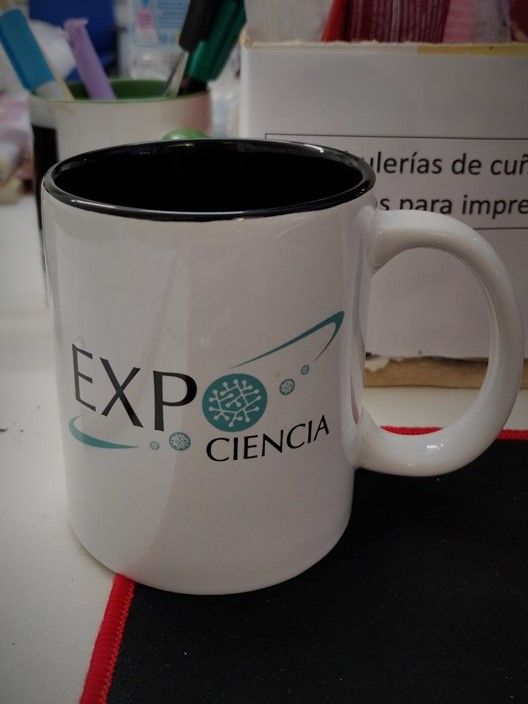
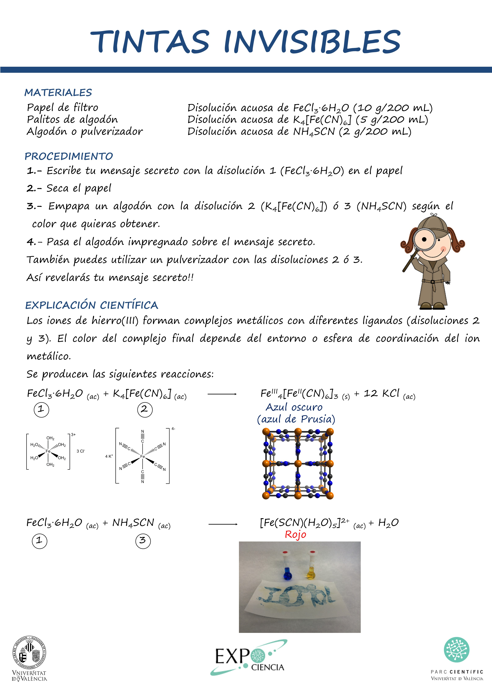

Divulgation have appealed me since a very early age. Some of my first activities are from before my university studies, we were a group of friends that really enjoy developing divulgation projects and we got the first position in a national competition in Spain two consecutive years! It was in 2009 and 2010. The projects were related with mathematics, I remember the first project in 2009 with which we explained the most efficient way to tie shoelaces using grid geometry. In the second year we developed a board game with which you could learn awesome curiosities from the integers to fractal images.

Nowadays, I continue participating in  divulgation projects. I have been collaborating  in "Expociencia" since the beginning of my master studies, around 2015. Expociencia is the open day in the Parc Científic of the Universitat de Valencia, It is celebrated each year on May. During this day scientists from the institute prepare more than 100 different activities. We show our installations and the work and research that we develop through experiments and performances, talks and tours to be enjoy by youngh students, families and everyone.
You can find some information about activities in which I have been participating [here](https://minipuntosdeciencia.tumblr.com/ 'Minipuntos de Ciencia').

**Example activity poster**

(Sorry these documents will be mainly in spanish)